# Randomness in Lua

## 1. `math.random()`

Lua provides `math.random()` for generating pseudorandom values.

```lua
local number = math.random(1, 10)
print(number)
```

This produces an integer between `1` and `10`, inclusive.

`math.random()` uses a **pseudorandom number generator (PRNG)**.

A PRNG generates values from an internal state:

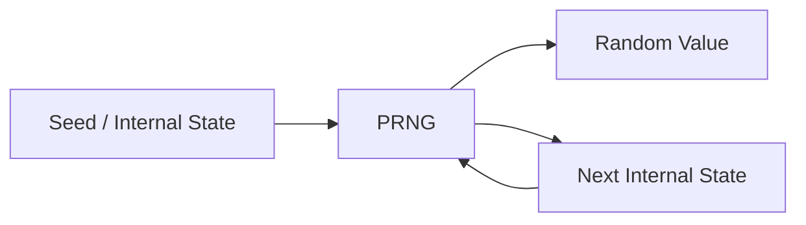

The values appear random, but the sequence is generated algorithmically.

If the same initial state is used, the same sequence can be reproduced.

---

## 2. `math.randomseed()`

A seed determines the initial state of a pseudorandom generator.

A common pattern is:

```lua
math.randomseed(os.time())
```

For example:

```lua
math.randomseed(os.time())

for i = 1, 5 do
    print(math.random(1, 100))
end
```

The idea is to give the PRNG a different starting state between program executions.

### Important: seed once

Do **not** repeatedly seed inside a loop:

```lua
-- Bad
for i = 1, 100 do
    math.randomseed(os.time())
    print(math.random(1, 100))
end
```

`os.time()` commonly has one-second resolution. Multiple calls within the same second can therefore receive the same seed.

Instead:

```lua
-- Good
math.randomseed(os.time())

for i = 1, 100 do
    print(math.random(1, 100))
end
```

The general flow should be:

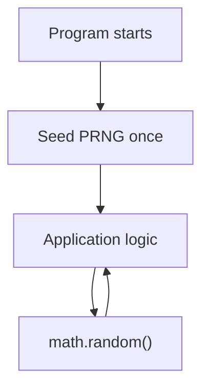

---

# 3. Pseudorandomness vs OS Randomness

There are two different concepts.

## Pseudorandomness

```lua
math.random()
```

A PRNG is:

* Fast
* Convenient
* Suitable for most games
* Suitable for simulations
* Deterministic given the same initial state
* Potentially reproducible

The general model is:

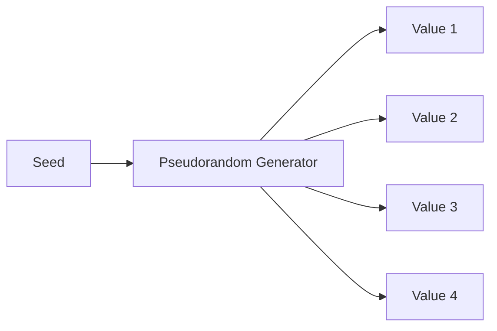

---

## OS-provided randomness

Unix systems provide random data through the operating system.

A common source is:

```text
/dev/urandom
```

The operating system maintains a secure random source and applications can request random bytes from it.

Conceptually:

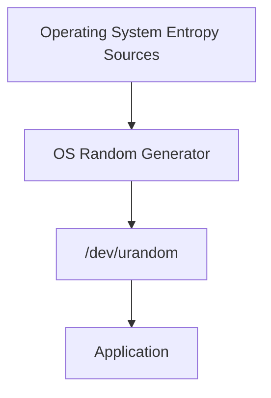

This is fundamentally different from simply doing:

```lua
math.randomseed(os.time())
```

The latter only changes the starting state of a PRNG.

---

# 4. Reading Random Bytes from `/dev/urandom`

On Unix-like systems, Lua can read random bytes from `/dev/urandom`.

For example:

```lua
local file = assert(io.open("/dev/urandom", "rb"))

local bytes = file:read(4)

file:close()

local number = string.unpack("<I4", bytes)

print(number)
```

The process is:

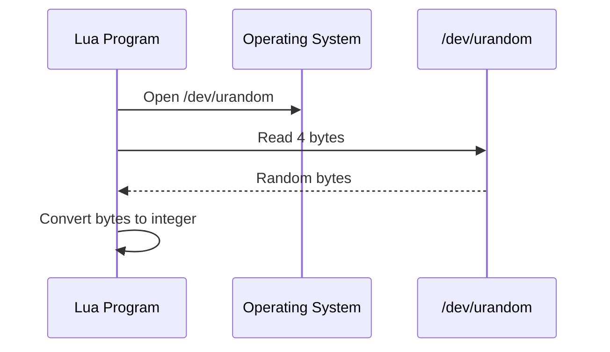

Unlike a simple time-based seed, the application isn't determining the random sequence from `os.time()`.

---

# 5. Creating a `secureRandom()` Function

You can wrap the OS random source:

```lua
local function secureRandom(min, max)
    local file = assert(io.open("/dev/urandom", "rb"))

    local bytes = file:read(4)

    file:close()

    local number = string.unpack("<I4", bytes)

    return min + (number % (max - min + 1))
end
```

Then:

```lua
local number = secureRandom(1, 100)

print(number)
```

Conceptually:


### Modulo bias

The expression:

```lua
number % (max - min + 1)
```

is convenient, but it can introduce **modulo bias** when the source range isn't evenly divisible by the desired range.

For ordinary experimentation or many gameplay situations, this may be acceptable.

For cryptographic applications, use a proper rejection-sampling approach or a trusted cryptographic random library.

---

# 6. Randomness Does Not Mean "No Repeats"

A common misconception is:

> Random values shouldn't repeat.

That is not true.

Suppose we randomly select from:

```text
1, 2, 3
```

A completely valid random sequence could be:

```text
2, 2, 2, 1, 3, 3, 2, 1, 1
```

Repeated values are expected.

The reason is simple: every individual selection is independent.

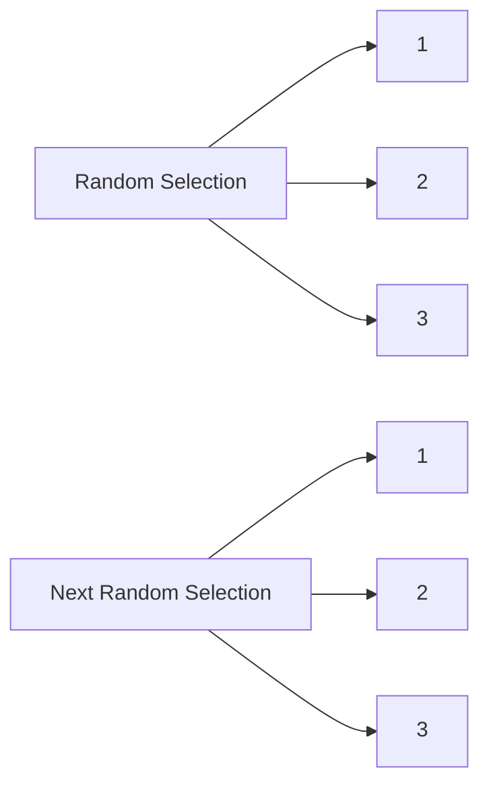

There is no rule saying:

```text
previous value != next value
```

unless you explicitly add such a rule.

---

# 7. Randomness vs No Repetition

These are different requirements.

### Random selection

```lua
local number = math.random(1, 10)
```

A value can repeat.

### Random selection without replacement

If you want:

```text
1 2 3 4 5
```

to appear in random order but each value to occur exactly once, you need a **shuffle**.

---

# 8. Fisher-Yates Shuffle

The Fisher-Yates algorithm randomly rearranges the elements of a table.

```lua
local function shuffle(t)
    for i = #t, 2, -1 do
        local j = math.random(1, i)

        t[i], t[j] = t[j], t[i]
    end

    return t
end
```

Create a table:

```lua
local numbers = {}

for i = 1, 10 do
    numbers[i] = i
end
```

Then shuffle:

```lua
shuffle(numbers)
```

One possible result:

```text
7
2
10
4
1
8
5
3
9
6
```

Every number appears exactly once.

### Fisher-Yates flow

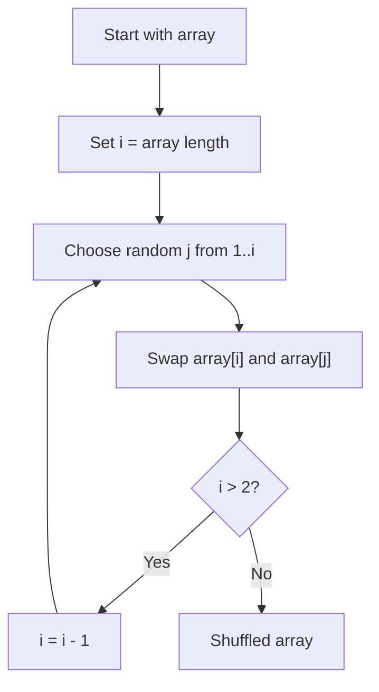

---

# 9. Shuffling Does Not Make Randomness More Random

This is important.

If you do:

```lua
shuffle(numbers)
```

and your `shuffle()` uses:

```lua
math.random()
```

then you're still using the PRNG.

The shuffle changes the **arrangement** of values.

It does not improve the underlying random source.


If the random source is:

```lua
math.random()
```

then the source remains pseudorandom.

---

# 10. Fixed Probability vs Random Lifetime

Suppose an engine has this:

```lua
if math.random(1, 10) == 3 then
    -- Engine failure
end
```

This explicitly defines:

```text
1 / 10 = 10%
```

So every time the condition is evaluated:

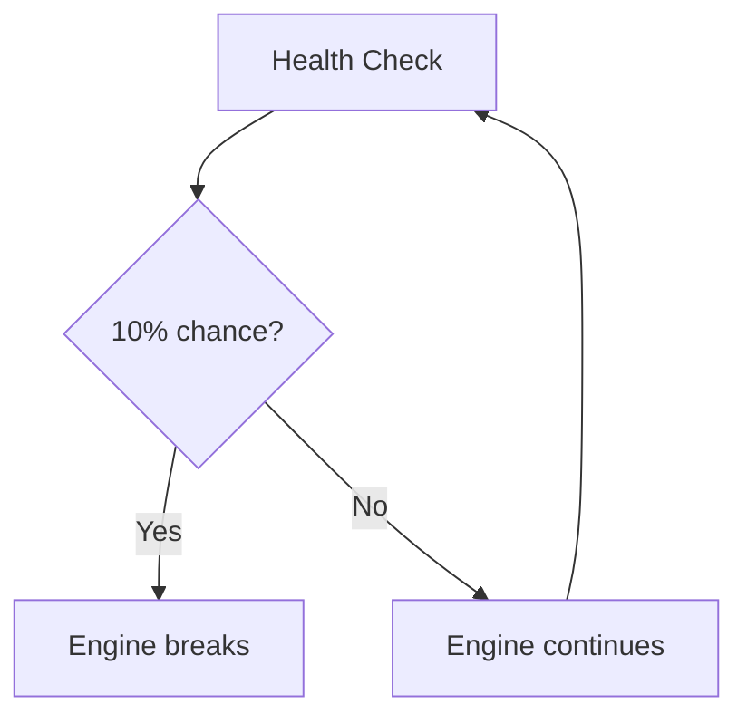

This is a **fixed per-check probability**.

---

# 11. Random Lifetime

If the goal is instead:

> Randomly determine how long the engine will survive.

then choose a lifetime when the engine starts.

For example:

```lua
function Engine:start()
    self.isRunning = true

    self.breakTime = os.time() + secureRandom(5, 30)

    print("Engine Started")
end
```

The engine might receive:

```text
8 seconds
17 seconds
23 seconds
29 seconds
...
```

Then:

```lua
function Engine:breaksdown()
    if self.isRunning and os.time() >= self.breakTime then
        print("The Engine broke down :(")

        self:stop()

        return true
    end

    return false
end
```

The flow becomes:

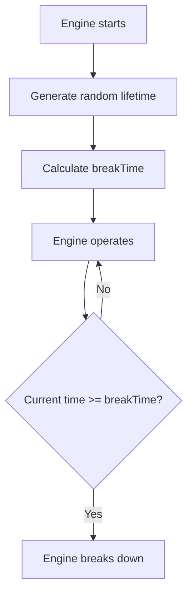

There is no repeated:

```text
10% chance
10% chance
10% chance
...
```

Instead, the engine receives a randomly selected lifetime.

---

# 12. "No Predefined Probability" Is Not Literally Possible

Every random process has an underlying probability distribution.

For example:

```lua
secureRandom(5, 30)
```

defines a range.

If the implementation is uniform, each integer in that range has approximately equal probability:

```text
5  6  7  8  9 ... 30
```

So randomness doesn't mean:

> "There is no probability."

Rather, you can avoid defining a particular **failure probability on every health check**.

Compare:

### Fixed per-check probability

```lua
if secureRandom(1, 100) <= 10 then
    -- failure
end
```

Model:

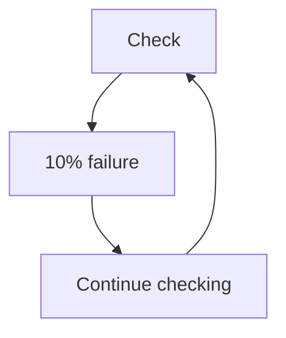

### Random lifetime

```lua
self.breakTime = os.time() + secureRandom(5, 30)
```

Model:

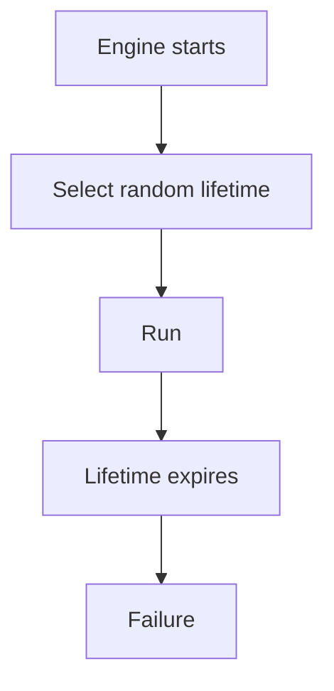

The second model avoids repeatedly rolling a fixed failure probability.

---

# 13. More Realistic Engine Failure

A real engine doesn't normally have a perfectly uniform lifetime.

A more realistic simulation could track:

```lua
engine.operatingTime
engine.temperature
engine.wear
engine.maintenance
```

These variables could influence the failure distribution.

Conceptually:

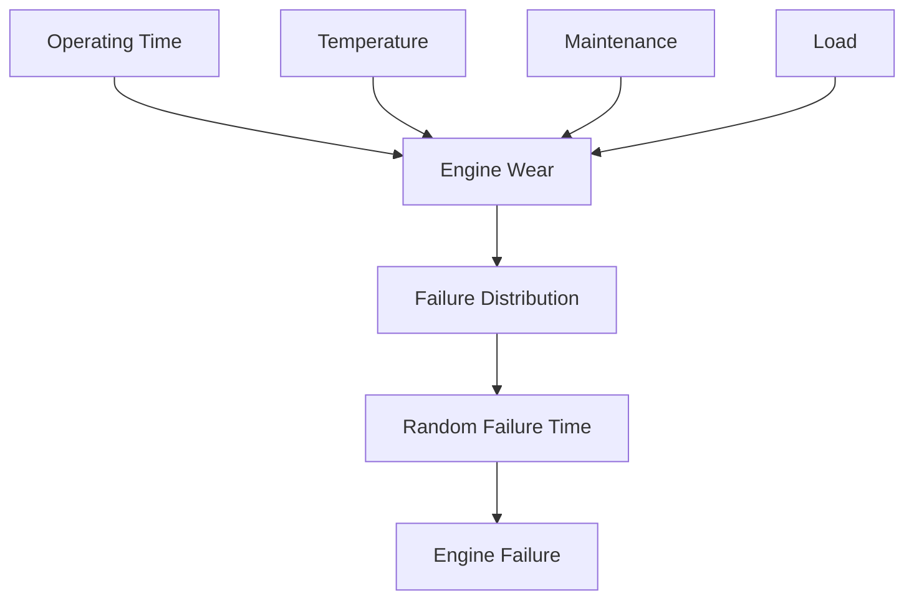

This is closer to **reliability modeling** than simply generating a random number.

---

# 14. Choosing the Right Approach

| Goal                        | Approach                     |
| --------------------------- | ---------------------------- |
| Random game damage          | `math.random()`              |
| Random enemy behavior       | PRNG                         |
| Procedural generation       | PRNG                         |
| Simulation                  | PRNG                         |
| Random item selection       | PRNG                         |
| Random ordering             | Fisher-Yates                 |
| No duplicate selection      | Sampling without replacement |
| Security tokens             | OS CSPRNG                    |
| Password-related randomness | OS CSPRNG                    |
| Unpredictable events        | OS randomness                |
| Random engine lifespan      | Random lifetime/distribution |

---

# 15. Important Concepts

### PRNG

```text
Pseudorandom Number Generator
```

Fast and deterministic given the same internal state.

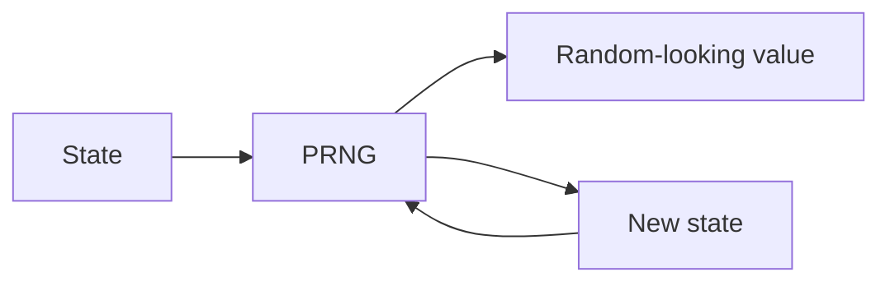

### OS CSPRNG

```text
Cryptographically Secure Pseudorandom Number Generator
```

Designed so that outputs are extremely difficult to predict without access to the generator's internal state.


### Randomness

Randomness does **not** mean:

```text
"No repeated values"
```

It means outcomes follow a probability distribution without the predictable pattern you are trying to avoid.

### Shuffle

A shuffle provides:

```text
Random ordering
+
No repetition within that ordering
```

It does not inherently provide a better random source.

---

# Summary

The key distinctions are:

```text
math.random()
    ↓
Pseudorandom Number Generator
    ↓
Fast and useful for games/simulations
```

versus:

```text
/dev/urandom
    ↓
Operating-System Random Source
    ↓
High-quality unpredictable random bytes
```

And:

```text
Randomness ≠ No Repetition
```

while:

```text
No Repetition → Shuffle / Sampling Without Replacement
```

Finally:

```text
Fixed failure probability
        ↓
Repeated probability checks
```

is different from:

```text
Random lifetime
        ↓
Choose failure time once
        ↓
Wait until that time
        ↓
Failure
```

For a game or simulation, use a PRNG when **speed and reproducibility** are useful. Use OS-provided cryptographic randomness when **unpredictability** is actually important.
